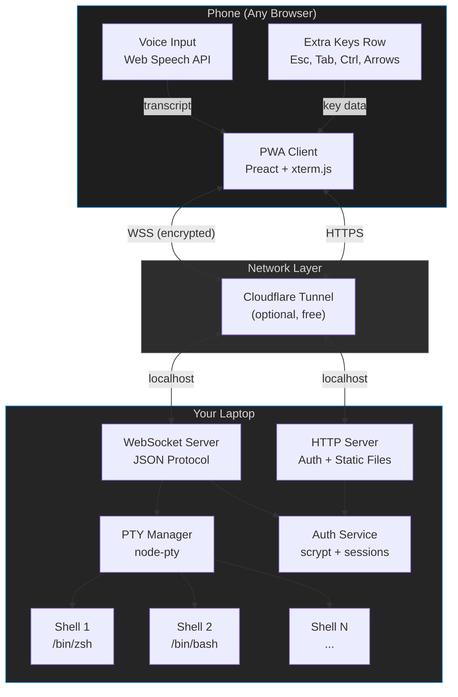
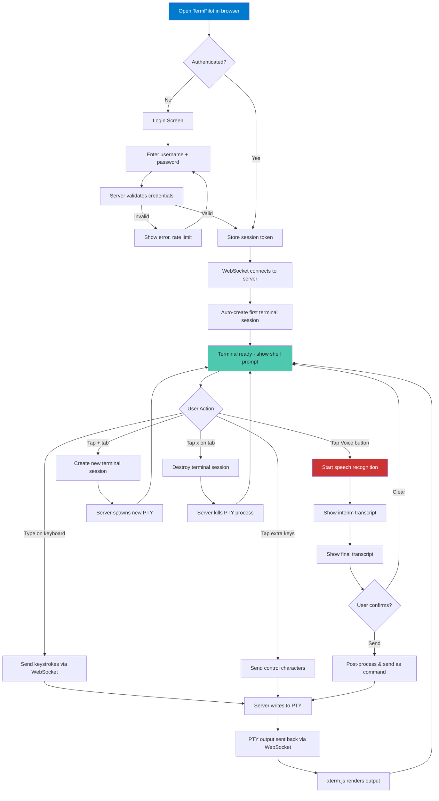
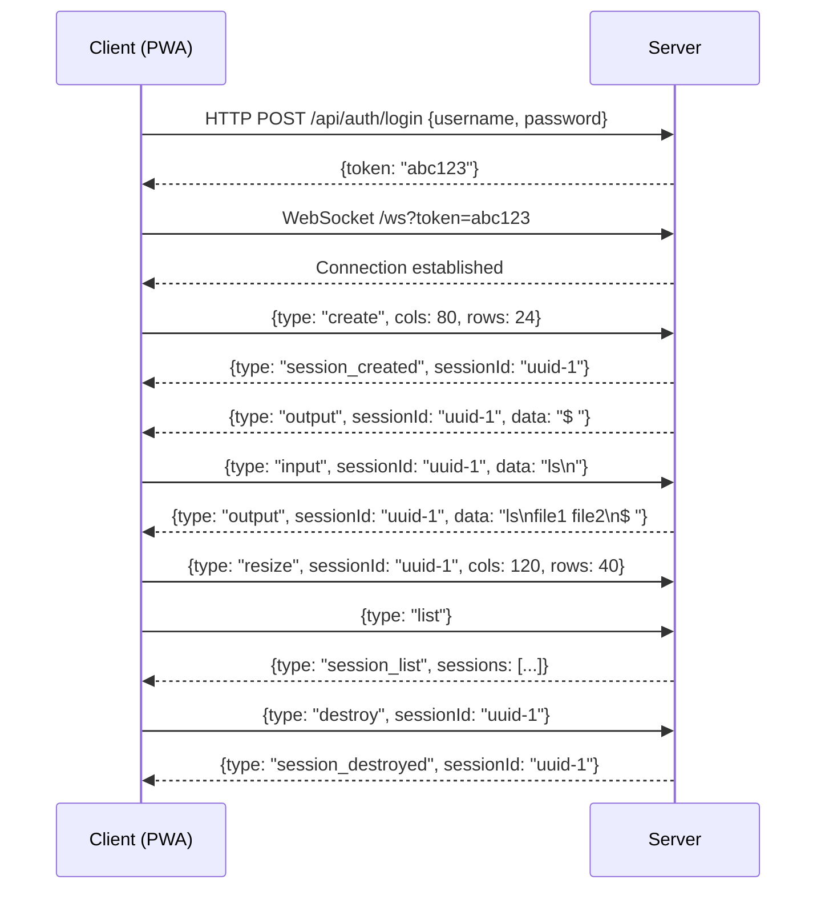
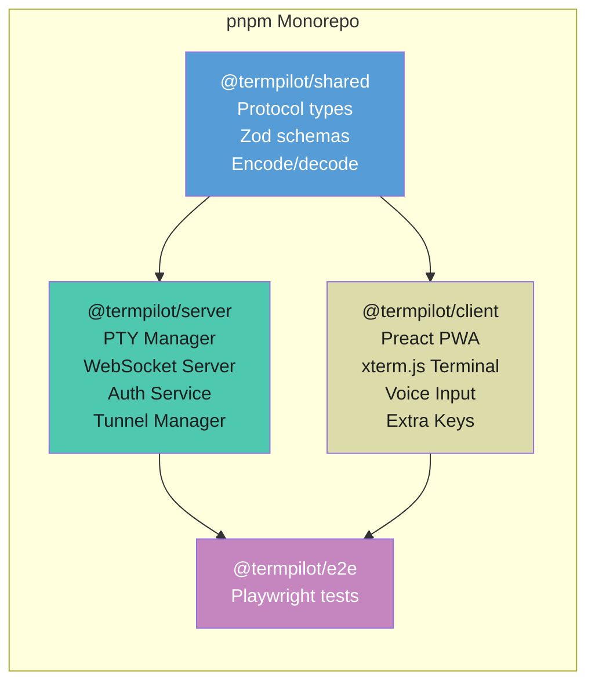
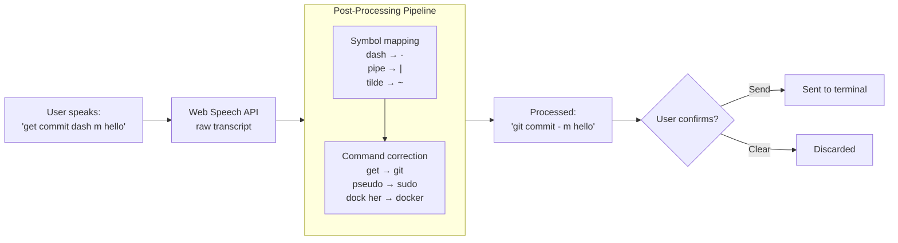
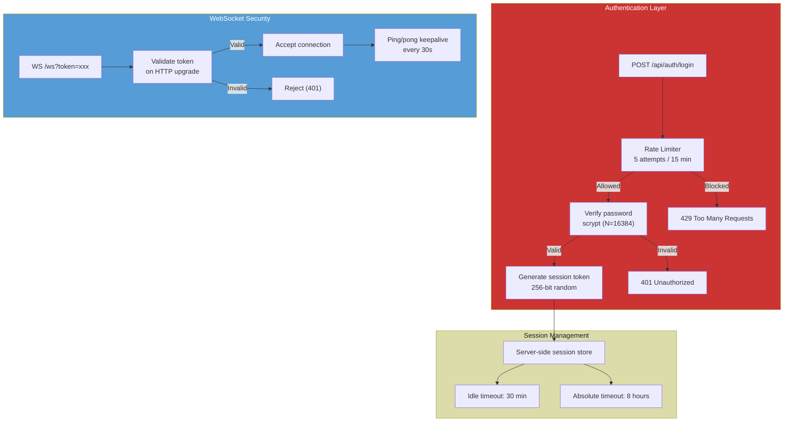

# TermPilot

**Mobile-first PWA for managing multiple terminal sessions remotely with voice control.**

TermPilot lets developers manage terminal windows on their laptop from their phone — with voice commands, multi-session tabs, and remote access from anywhere. Built from scratch, completely free, no paid services required.

---

## Features

- **Multi-terminal management** — Create, destroy, and switch between terminal sessions from your phone
- **Voice commands** — Transcribe voice to terminal commands via Web Speech API with smart post-processing for developer vocabulary
- **Remote access** — Access your terminals from anywhere via Cloudflare Tunnel (free), not just your local network
- **Mobile-optimized UI** — Extra keys row (Esc, Tab, Ctrl, arrows), safe area support for notch/home indicator, responsive design
- **PWA installable** — Add to home screen for a native app-like experience, works offline (app shell cached)
- **Secure** — Password authentication with scrypt hashing, server-side sessions, rate limiting, session timeouts

---

## Architecture



---

## User Flow



---

## WebSocket Protocol



---

## Project Structure



```
termpilot/
├── package.json                    # Root workspace config
├── pnpm-workspace.yaml
├── tsconfig.base.json              # Shared TypeScript settings
├── vitest.workspace.ts
├── packages/
│   ├── shared/                     # @termpilot/shared
│   │   ├── src/
│   │   │   ├── protocol.ts         # Message types & encode/decode
│   │   │   ├── schemas.ts          # Zod validation schemas
│   │   │   └── index.ts            # Public API
│   │   └── test/
│   │       ├── protocol.test.ts    # 12 tests
│   │       └── schemas.test.ts     # 12 tests
│   ├── server/                     # @termpilot/server
│   │   ├── src/
│   │   │   ├── app.ts              # HTTP + WebSocket server
│   │   │   ├── index.ts            # Entry point + CLI
│   │   │   ├── terminal/
│   │   │   │   └── pty-manager.ts  # PTY lifecycle management
│   │   │   ├── auth/
│   │   │   │   └── auth-service.ts # Auth + rate limiting
│   │   │   └── tunnel/
│   │   │       └── tunnel-manager.ts # Cloudflare Tunnel
│   │   └── test/
│   │       ├── unit/               # 38 unit tests
│   │       └── integration/        # 14 integration tests
│   ├── client/                     # @termpilot/client
│   │   ├── index.html              # PWA shell
│   │   ├── vite.config.ts          # Vite + PWA plugin
│   │   ├── src/
│   │   │   ├── main.tsx            # Entry point
│   │   │   ├── components/
│   │   │   │   ├── App.tsx         # Root component
│   │   │   │   ├── Login.tsx       # Auth screen
│   │   │   │   ├── TerminalView.tsx # Session tabs + terminal
│   │   │   │   ├── TerminalInstance.tsx # xterm.js wrapper
│   │   │   │   ├── ExtraKeys.tsx   # Mobile key toolbar
│   │   │   │   └── VoiceInput.tsx  # Voice recognition UI
│   │   │   ├── services/
│   │   │   │   ├── api.ts          # Auth API client
│   │   │   │   ├── ws-client.ts    # WebSocket with reconnection
│   │   │   │   └── voice.ts        # Speech recognition + post-processing
│   │   │   └── styles/
│   │   │       └── global.css      # Mobile-first styles
│   │   └── test/
│   │       └── voice.test.ts       # 9 tests
│   └── e2e/                        # @termpilot/e2e (Playwright)
│       └── tests/
```

---

## Voice Command Processing



### Supported Voice Symbols

| Spoken | Output | Spoken | Output |
|--------|--------|--------|--------|
| dash / hyphen | `-` | pipe | `\|` |
| double dash | `--` | ampersand | `&` |
| dot / period | `.` | double ampersand | `&&` |
| slash | `/` | at / at sign | `@` |
| backslash | `\` | hash / pound | `#` |
| tilde | `~` | dollar / dollar sign | `$` |
| star / asterisk | `*` | equals / equal sign | `=` |
| colon | `:` | semicolon | `;` |
| quote | `"` | single quote / tick | `'` |
| backtick | `` ` `` | open/close bracket | `[ ]` |
| open/close brace | `{ }` | open/close paren | `( )` |
| greater than | `>` | less than | `<` |

---

## Security Model



---

## Getting Started

### Prerequisites

- **Node.js** >= 20.0.0
- **pnpm** >= 9.0.0
- **cloudflared** (optional, for remote access) — `brew install cloudflared`

### Installation

```bash
git clone https://github.com/Abhishekreddy31/TermPilot.git
cd TermPilot
pnpm install
```

### Quick Start

```bash
# Build and start (prints login credentials to console)
pnpm start
```

Open `http://localhost:3000` on your phone (same Wi-Fi) or desktop browser.

### With Remote Access

```bash
# Start with Cloudflare Tunnel for access from anywhere
pnpm start -- --tunnel
```

The tunnel URL will be printed to the console. Open it on any device, anywhere.

### Custom Password

```bash
TERMPILOT_PASSWORD=mysecretpassword pnpm start
```

### Development

```bash
# Run server and client dev servers in parallel
pnpm dev

# Server only (with hot reload)
pnpm dev:server

# Client only (Vite dev server with HMR)
pnpm dev:client
```

---

## Testing

```bash
# Run all tests (85 tests across 3 packages)
pnpm test

# Watch mode
pnpm test:watch

# With coverage
pnpm test:coverage
```

### Test Breakdown

| Package | Tests | Type |
|---------|-------|------|
| `@termpilot/shared` | 24 | Protocol encode/decode, schema validation |
| `@termpilot/server` | 52 | PTY lifecycle, auth, rate limiting, WebSocket integration |
| `@termpilot/client` | 9 | Voice post-processing, symbol mapping |
| **Total** | **85** | |

---

## Tech Stack

| Layer | Technology | Why |
|-------|-----------|-----|
| Monorepo | pnpm workspaces | Strict dependency isolation, fast installs |
| Server runtime | Node.js + TypeScript | Native PTY support via node-pty |
| Terminal backend | node-pty | Same library powering VS Code's terminal |
| WebSocket | ws | Fastest pure-JS WebSocket for Node.js |
| Client framework | Preact | 3KB React alternative, minimal bundle |
| Terminal frontend | xterm.js | Industry-standard terminal emulator |
| Build tool | Vite | Fast builds, PWA plugin, HMR |
| PWA | vite-plugin-pwa + Workbox | Service worker, app shell caching |
| Voice | Web Speech API | Free, built into browsers, no API keys |
| Remote access | Cloudflare Tunnel | Free, automatic TLS, no port forwarding |
| Auth | scrypt (Node.js crypto) | Zero dependencies, constant-time comparison |
| Testing | Vitest | Fast, ESM-native, Jest-compatible API |
| Validation | Zod | Runtime type safety for WebSocket messages |

---

## How It Works

1. **Server starts** on your laptop, spawning an HTTP + WebSocket server
2. **You log in** from your phone's browser with the credentials shown in the console
3. **A terminal session** is created — the server spawns a PTY (pseudo-terminal) running your shell
4. **Everything you type** (keyboard, extra keys, or voice) is sent over WebSocket to the server, which writes it to the PTY
5. **PTY output** (command results, prompts) flows back over WebSocket to xterm.js in your browser
6. **Multiple sessions** can run simultaneously, managed via tabs
7. **If you enable the tunnel**, Cloudflare proxies traffic so you can access your terminals from anywhere, encrypted

### Cost: $0

- No cloud servers — your laptop is the server
- No paid APIs — voice uses the browser's built-in engine
- No app store fees — it's a PWA, runs in any browser
- No paid tunneling — Cloudflare Tunnel free tier, unlimited

---

## License

MIT
