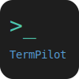
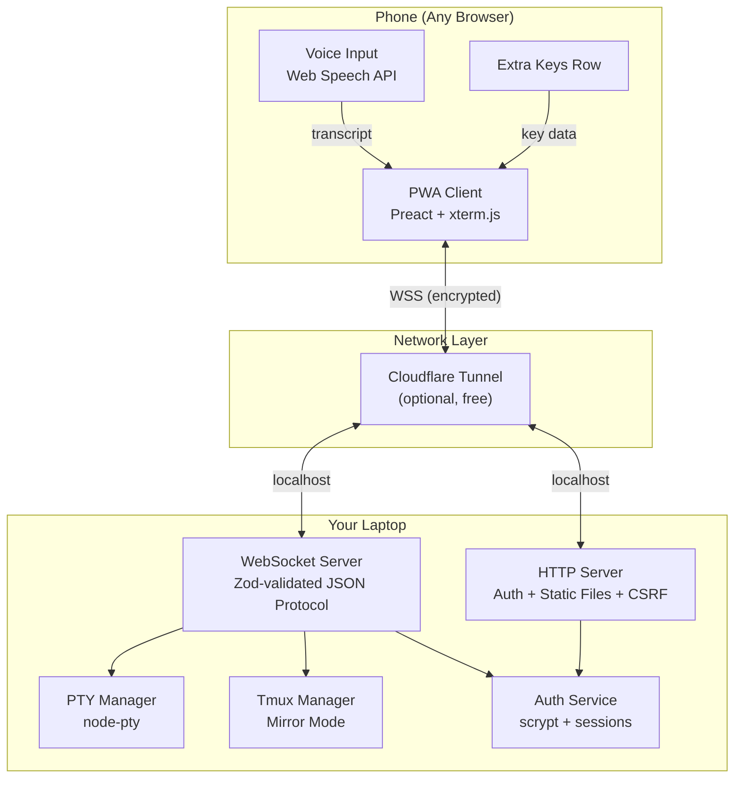
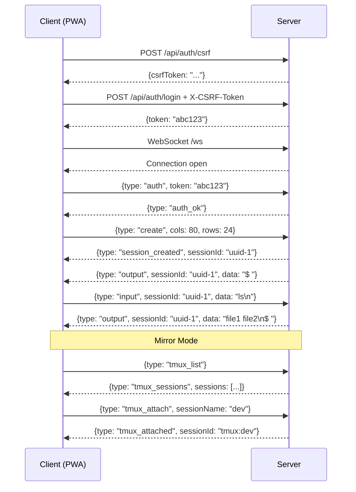

<p align="center">
  
</p>

<h1 align="center">TermPilot</h1>

<p align="center">
  <strong>Control your laptop's terminal from your phone.</strong><br>
  Voice commands, multi-session tabs, real-time mirroring, remote access from anywhere.
</p>

<p align="center">
  
  
  
  
  
  
  
  
  
</p>

<p align="center">
  <a href="#quick-start">Quick Start</a> •
  <a href="#features">Features</a> •
  <a href="#how-it-works">How It Works</a> •
  <a href="#architecture">Architecture</a> •
  <a href="#security">Security</a> •
  <a href="#quick-start">Quick Start</a> •
  <a href="#why-termpilot">Why TermPilot?</a> •
  <a href="#contributing">Contributing</a>
</p>

<!--
  TODO: Add a demo GIF here for maximum visual impact.
  Record with: iPhone screen record → convert to GIF
  Show: login → type a command → voice command → switch tabs → mirror mode
  Place the GIF with:
  <p align="center">
    
  </p>
-->

---

## Quick Start

```bash
# Install and run (one command)
npx term-pilot

# Or install globally
npm install -g term-pilot
term-pilot

# With remote access from anywhere
term-pilot --tunnel
```

Credentials are written to `~/.termpilot/credentials`. Open the URL on your phone.

### From source

```bash
git clone https://github.com/Abhishekreddy31/TermPilot.git
cd TermPilot
pnpm install
pnpm start
```

---

## Features

### Two Modes

| Mode | What it does |
|------|-------------|
| **Independent Sessions** | Create fresh terminal sessions from your phone — like opening new Terminal.app windows |
| **Mirror Mode** | Attach to existing tmux sessions running on your laptop — bidirectional real-time mirroring |

### Core Capabilities

- **Multi-terminal tabs** — Create, switch, and destroy terminal sessions
- **Voice commands** — Speak commands, confirm, execute. Understands developer vocabulary (`"git commit dash m"` → `git commit -m`)
- **Extra keys toolbar** — Esc, Tab, Ctrl, Alt, arrow keys, PgUp/PgDn, pipe, tilde — keys your phone keyboard doesn't have
- **Touch scrolling** — Swipe to scroll through terminal history (5000 lines)
- **Remote access** — Cloudflare Tunnel gives you a public HTTPS URL for free. Access your terminals from cellular, coffee shop WiFi, anywhere
- **PWA installable** — Add to home screen for a native app experience. App shell cached for instant loading
- **Zero cost** — No cloud servers, no paid APIs, no app store fees, no subscriptions

---

## How It Works

```
Phone (browser/PWA)                Your Laptop
┌──────────────────┐              ┌──────────────────────┐
│  xterm.js        │◄──WebSocket──│  Node.js Server      │
│  Voice Input     │──────────────│  ├─ PTY Manager      │
│  Extra Keys      │              │  │  └─ /bin/zsh      │
│  Session Tabs    │              │  ├─ Tmux Manager     │
│  Login Screen    │              │  │  └─ tmux attach   │
└──────────────────┘              │  ├─ Auth (scrypt)    │
         │                        │  └─ Cloudflare Tunnel│
         │ (optional)             └──────────────────────┘
         │
    Cloudflare Edge
    (free, auto TLS)
```

1. **Server starts** on your laptop, binds to `localhost:3000`
2. **You log in** from your phone with the credentials from `~/.termpilot/credentials`
3. **A terminal session** is created — the server spawns a real shell (bash/zsh) via a pseudo-terminal (PTY)
4. **Everything you type** (keyboard, extra keys, or voice) goes over WebSocket → server writes to PTY
5. **Shell output** flows back over WebSocket → xterm.js renders it on your phone
6. **Mirror mode**: attach to existing tmux sessions for bidirectional mirroring — what you see on your laptop, you see on your phone
7. **Tunnel mode**: Cloudflare proxies traffic so you can access from any network

---

## Architecture



### WebSocket Protocol



---

## Project Structure

```
termpilot/
├── packages/
│   ├── shared/                     # @termpilot/shared
│   │   └── src/
│   │       ├── protocol.ts         # Binary message types + encode/decode
│   │       ├── schemas.ts          # Zod validation (session, tmux, input, resize)
│   │       └── index.ts
│   ├── server/                     # @termpilot/server
│   │   └── src/
│   │       ├── cli/cli.ts          # CLI entry point (--port, --tunnel, --help)
│   │       ├── app.ts              # HTTP + WebSocket server + message routing
│   │       ├── terminal/
│   │       │   ├── pty-manager.ts  # PTY lifecycle, output buffering, idle sweep
│   │       │   ├── tmux-manager.ts # tmux list/attach/detach/create/kill
│   │       │   └── safe-env.ts     # Environment variable allowlist
│   │       ├── auth/
│   │       │   └── auth-service.ts # scrypt hashing, sessions, rate limiting
│   │       └── tunnel/
│   │           └── tunnel-manager.ts
│   ├── client/                     # @termpilot/client (Preact PWA)
│   │   └── src/
│   │       ├── components/         # App, Login, TerminalView, ExtraKeys, VoiceInput
│   │       ├── services/           # API client, WebSocket client, Voice service
│   │       └── styles/global.css
│   └── e2e/                        # Playwright (future)
├── scripts/build-publish.js        # esbuild bundler for npm publishing
├── LICENSE                         # MIT
└── package.json                    # npm package config with bin entry
```

---

## Security

TermPilot underwent three full security audits. Current posture: **0 critical, 0 high, 0 medium vulnerabilities.**

| Layer | Protection |
|-------|-----------|
| **Authentication** | scrypt (N=16384) password hashing, timing-safe comparison, 256-bit session tokens |
| **Sessions** | Server-side session store, 30-min idle timeout, 8-hour absolute timeout, periodic cleanup |
| **CSRF** | Token-based protection on all POST endpoints |
| **WebSocket** | Token sent as first message (never in URL), 10s auth timeout, per-IP rate limiting |
| **Authorization** | Session ownership enforced — can only interact with your own terminals |
| **Transport** | Cloudflare Tunnel provides automatic TLS. Default bind to localhost only |
| **PTY isolation** | Environment variable allowlist prevents server secret leakage |
| **Input validation** | All WebSocket messages validated via Zod schemas |
| **Headers** | CSP, X-Frame-Options DENY, X-Content-Type-Options nosniff, Referrer-Policy no-referrer |
| **Rate limiting** | Login: 5 attempts/15min per IP. WebSocket auth: 10 attempts/min per IP |
| **Connection limits** | Max 20 concurrent WebSocket connections, 64KB message size limit |

---

## Voice Commands

Speak naturally. TermPilot post-processes transcripts for developer vocabulary:

| You say | Terminal gets |
|---------|-------------|
| "git status" | `git status` |
| "git commit dash m hello" | `git commit -m hello` |
| "ls pipe grep test" | `ls \| grep test` |
| "cd tilde slash projects" | `cd ~/projects` |
| "pseudo apt install node" | `sudo apt install node` |
| "dock her ps" | `docker ps` |

Supports 30+ symbol mappings (dash, pipe, tilde, ampersand, brackets, etc.) and common command corrections.

---

## CLI Options

```
term-pilot [options]

Options:
  --port <port>    Port to listen on (default: 3000)
  --host <host>    Bind address (default: 127.0.0.1)
  --tunnel         Enable Cloudflare Tunnel for remote access
  --help, -h       Show help
  --version, -v    Show version

Environment variables:
  PORT                 Server port
  HOST                 Bind address
  TUNNEL=1             Enable tunnel
  TERMPILOT_PASSWORD   Set a fixed password
```

---

## Testing

```bash
pnpm test          # Run all 103 tests
pnpm test:watch    # Watch mode
pnpm test:coverage # With coverage
```

| Package | Tests | Coverage |
|---------|-------|----------|
| `@termpilot/shared` | 24 | Protocol encode/decode, Zod schema validation |
| `@termpilot/server` | 70 | PTY lifecycle, auth, rate limiting, CSRF, WebSocket integration, tmux mirror mode |
| `@termpilot/client` | 9 | Voice post-processing, symbol mapping |
| **Total** | **103** | |

---

## Tech Stack

| Component | Technology | Why |
|-----------|-----------|-----|
| Server | Node.js + TypeScript | Native PTY support via node-pty |
| Terminal backend | node-pty | Powers VS Code's terminal |
| WebSocket | ws + perMessageDeflate | Fast, compressed real-time communication |
| Validation | Zod | Runtime type safety on all messages |
| Client | Preact (3KB) + xterm.js | Minimal bundle, industry-standard terminal |
| Build | Vite + esbuild | Fast builds, PWA support, npm bundling |
| Voice | Web Speech API | Free, built into Chrome/Safari |
| Remote access | Cloudflare Tunnel | Free, automatic TLS |
| Auth | Node.js crypto (scrypt) | Zero dependencies |
| Testing | Vitest | Fast, ESM-native |

---

## Platform Support

| Platform | Independent Mode | Mirror Mode (tmux) | Tunnel |
|----------|-----------------|-------------------|--------|
| macOS | Full | Full | Full |
| Linux | Full | Full | Full |
| Windows + WSL | Full (PowerShell) | Full (via WSL) | Full |
| Windows (no WSL) | Full (PowerShell) | Not available | Full |

> **Windows users**: Mirror mode routes through WSL automatically. Just install tmux inside WSL:
> ```bash
> wsl --install          # Install WSL (if not already)
> wsl sudo apt install tmux  # Install tmux inside WSL
> ```

---

## Why TermPilot?

There are other tools in this space. Here's how TermPilot compares:

| Feature | TermPilot | ttyd | gotty | wetty | code-server |
|---------|:---------:|:----:|:-----:|:-----:|:-----------:|
| Multi-session tabs | Yes | No | No | No | Yes |
| Voice commands | Yes | No | No | No | No |
| Mirror existing terminals (tmux) | Yes | No | No | No | No |
| Mobile-optimized UI | Yes | No | No | No | Partial |
| Extra keys toolbar | Yes | No | No | No | No |
| Remote access (free) | Yes | Manual | Manual | Manual | Manual |
| Touch scrolling | Yes | No | No | No | Partial |
| PWA installable | Yes | No | No | No | Yes |
| Zero cost | Yes | Yes | Yes | Yes | Yes |
| Single command install | `npx term-pilot` | Build from source | Archived | npm | npm |
| Windows support | Full + WSL | Linux only | Linux/macOS | Linux | Linux/macOS |

**TermPilot is the only tool that combines** multi-session management, voice commands, tmux mirroring, and a mobile-first PWA — all installable with a single command and zero cost.

---

## Contributing

Contributions are welcome. Please:

1. Fork the repo
2. Create a feature branch (`git checkout -b feat/my-feature`)
3. Write tests for new functionality
4. Ensure `pnpm test` passes
5. Submit a pull request

### Development

```bash
pnpm install
pnpm dev          # Server + client with hot reload
pnpm dev:server   # Server only
pnpm dev:client   # Client only (Vite HMR)
pnpm test         # Run all tests
pnpm run build    # Build all packages
```

---

---

<p align="center">
  <strong>If TermPilot is useful to you, consider giving it a star.</strong><br>
  It helps others discover the project.
</p>

<p align="center">
  <a href="https://github.com/Abhishekreddy31/TermPilot/stargazers">⭐ Star this repo on GitHub</a>
</p>

---

## License

MIT — see [LICENSE](LICENSE)
